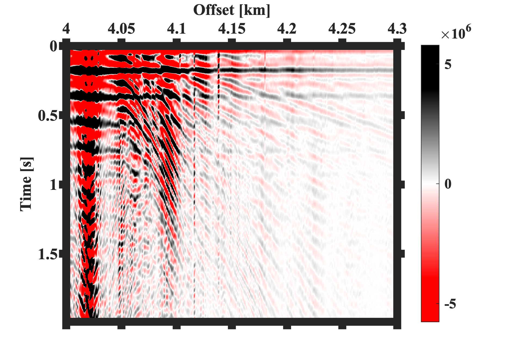

# Source wavelet estimation
The autocorrelation of seismic signals can provide some preliminary information about the source. 

The code `SOURCE_WAVELET_ESTIMATION.m` was written to auto-correlate two files of seismic data in Segy format (`synthetic_data1.segy` and `synthetic_data2.segy`). The source wavelet is estimated based on the autocorrelation, and its amplitude and phase spectra can be found in the folder. 

A) Auto-correlation of seismic signals:

B)Estimated source wavelet:

B)Amplitude spectrum of the source:

`DISCLAIMER`:  I don't warrant this code in any way whatsoever. This code is provided "as-is" to be used at your own risk.
This work was done as part of my PhD, I would be happy if you could cite my PhD thesis (will be publihsed soon):
Seismic tomography of an amagmatic ultra-slow spreading
ridge
